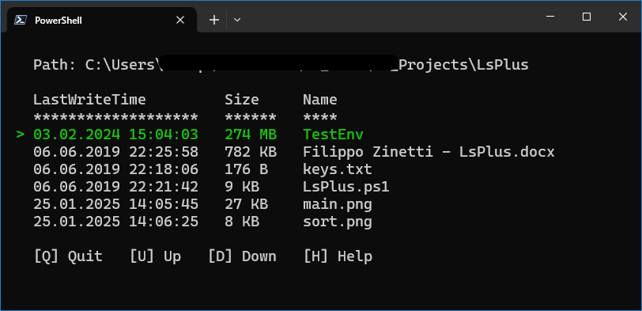
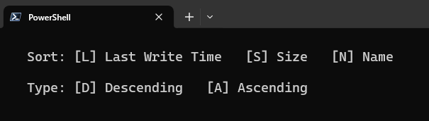
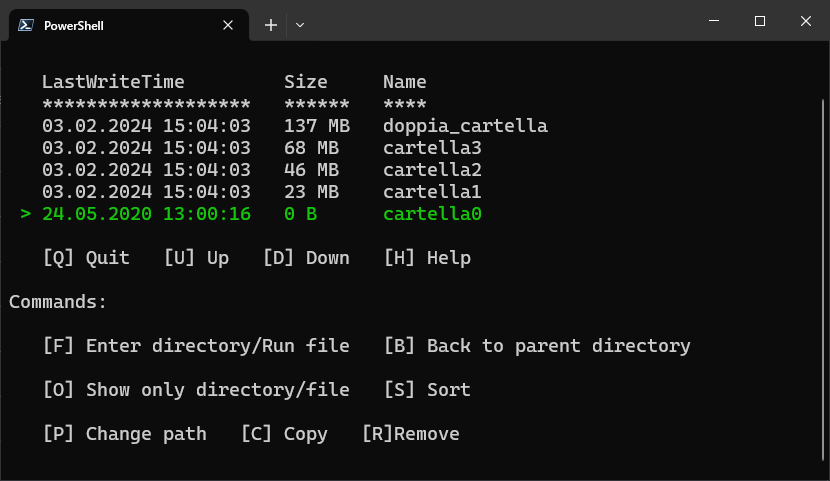

# 📂 LsPlus: Instant file navigation from command line
LsPlus is a minimal command line tool designed to enhance folder navigation. Developed as a school project, LsPlus provides flexible options for viewing and managing directory contents.

  

## 💡 Overview
This script is designed to be executed from the terminal and is immediately ready for use upon invocation.
The motivation is easy: get file and folder sizes at a glance. Indeed, this is yet not included in Windows default Explorer.

  

## ⚙️ Parameters
The script accepts four optional parameters:
- `--path`: Specifies the folder whose information will be displayed by the script. The path can be either relative or absolute.
- `--log`: Determines whether a log file should be created. If not specified, no log file is generated. Providing any value will create a log file in the same directory as the script, containing details of operations performed and any errors encountered.`
- `--liveLog`: Displays the progress of the search in real-time in the terminal. Providing any value will enable this feature.
- `--csv`: Specifies the configuration file for importing commands. It can have any format, but it will be read as CSV. If not specified, default commands are used. The file must have two columns: “action” (used to distinguish various commands) and “value” (the key that will activate the command). An example is provided in the keys.csv file.

## 🛠 Available Commands
The following commands are available while using the tool (default values in parentheses):
- Reload (-): Internally used by the script to reload data, but also accessible to users if needed.
- Quit (Q): Terminates the script.
- Help (H): Displays possible actions.
- ChangePath (P): Sets a new path to navigate.
- Forward (F): Enters the selected folder or launches the selected file.
- Back (B): Moves to the parent folder of the current directory.
- Up (U): Moves the cursor up.
- Down (D): Moves the cursor down.
- Copy (C): Copies the selected item to the specified location.
- Remove (R): Deletes the item after confirmation.
- Sort (S): Allows sorting of items by:
    - LastWriteTime (L): Sort by the last modified date.
    - Size (S): Sort by size.
    - Name (N): Sort by name.
        - Descending (D): In descending order.
        - Ascending (A): In ascending order.
- Only (O): Displays only items of a specific type:
    - Directory (D): Shows only folders.
    - File (F): Shows only files.
    - All (A): Shows all files.

  

## 📜 License
This project is licensed under the MIT License. See the license file for details.